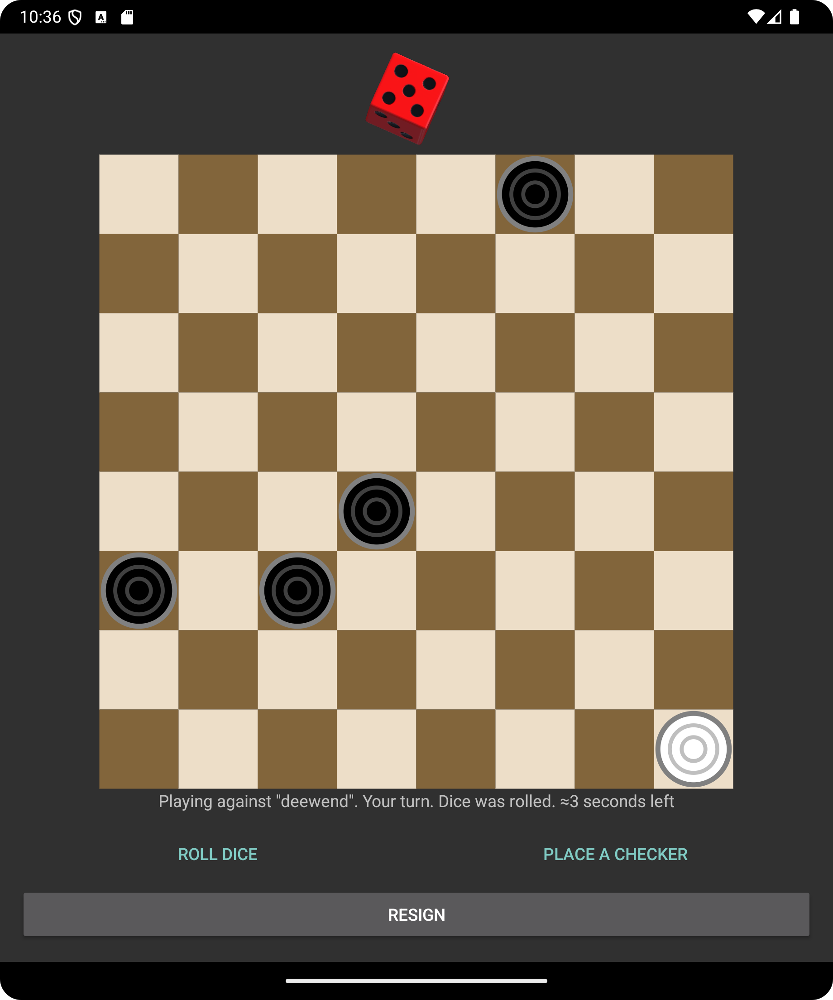

# Cheshka
An Android Parchís/Ludo game impementation, done on chess board.

### Assets Attribution
[`app/src/main/assets/dicerolls.png`](https://github.com/minecraft8997/Cheshka/blob/master/app/src/main/assets/dicerolls.png) file is based on `Glossy Red Dice Rolls.png` by [Greg Bradburn](https://gitlab.com/midniteoilsoftware), licensed under the MIT License. Modifications include resizing the image and changing the order of dice sprites. Original work can be found in the [2d-dice-roller repository](https://gitlab.com/midnite-oil-software-tutorials/2d-dice-roller/-/blob/main/Assets/Art/Glossy%20Red%20Dice%20Rolls.png).

[`app/src/main/assets/zapsplat_dice_roll_*.mp3`](https://github.com/minecraft8997/Cheshka/blob/master/app/src/main/assets) files were obtained from ZapSplat, licensed under the [Standard License](https://www.zapsplat.com/license-type/standard-license). The work can be found on the following page: https://www.zapsplat.com/music/dice-throw-roll-on-board-game-playing-board-1/

[`app/src/main/assets/zapsplat_piece_*.mp3`](https://github.com/minecraft8997/Cheshka/blob/master/app/src/main/assets) files were obtained from ZapSplat, licensed under the [Standard License](https://www.zapsplat.com/license-type/standard-license). The work can be found on the following page: https://www.zapsplat.com/music/chess-game-piece-place-down-on-board-square-1/

## Hosting a server
Please take a look at [CheshkaServer](https://github.com/minecraft8997/CheshkaServer) repository.
